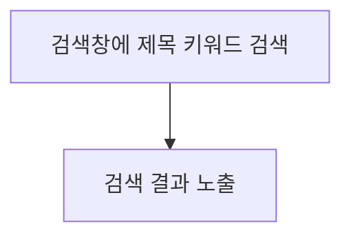

# 📄 기능 정의서

## 📌 로그인 기능

### 👤 사용자 스토리

---

- 우리 회사 인트라넷을 사용하기 위해 로그인하고 싶습니다.
- 관리자 권한이 있는 계정으로 로그인하면 관리자만 사용할 수 있는 기능이 필요합니다.

### 📑 기능 단위

---

**◼️ 로그인 기능**

- 기능 설명
  - 이메일와 비밀번호를 입력하여 인트라넷에 로그인 할 수 있다.
- 입력 항목
  - 이메일
  - 비밀번호
- 유효성 검사
  - 올바르지 않은 이메일, 비밀번호일 경우 - 이메일, 비밀번호를 확인해주세요.
- 사용자 액션
  - 로그인 버튼 클릭
    - 입력 항목 유효성 검사 실행
    - 유효성 검사 오류 발생시 로그인 절차는 종료되며 사용자에게 오류 정보 알림
    - 유효성 검사 통과시 메인 페이지로 전환
    - 관리자 권한이 있는 계정일 경우는 메뉴에 관리자 탭 활성화
    ```mermaid
    flowchart TD
        A[로그인 버튼 클릭] --> B[입력 항목 유효성 검증]
        B{유효한 입력} -- 예 --> C[로그인 성공]
        B{유효한 입력} -- 아니오 --> D[오류 표시]
        D --> A
        C -- 관리자 권한이 있는 계정일 경우 --> E[메뉴에 관리자탭 활성화된 메인페이지로 전환]
        C -- 일반 사용자 계정일 경우 --> F[메인페이지로 전환]
    ```

## 📌 메인 페이지 기능

### 👤 사용자 스토리

---

- 회사에 출근해서 메인 페이지의 근태 관리 기능을 통해 출/퇴근을 관리하고 싶습니다.
- 현재 시간을 확인하고 가장 최근에 올라온 공지사항을 확인하고 싶습니다.

### 📑 기능 단위

---

**◼️ 현재 시간 확인 기능**

- 기능 설명
  - 현재 시간을 표시하는 시계를 통해 시간을 확인 할 수 있다.
- 사용자 액션
  - 메인 페이지 접근(인트라넷 접속)
  ```mermaid
  flowchart TD
  A[인트라넷 접속] --> B[메인페이지에 현재시간 노출]
  ```

**◼️ 근태 관리 기능**

- 기능 설명
  - 토글 버튼으로 출/퇴근을 관리할 수 있다.
- 사용자 액션

  - 메인 페이지에 있는 근무 시작 버튼 클릭

  ```mermaid
    flowchart TD
      A[인트라넷 접속] --> B(근무 시작 버튼클릭) -->
      C{근무 시작 여부확인}
      C -->|확인| E[근무 시작 상태로 변경]
      C -->|취소| A
  ```

  - 메인페이지에 있는 근무 종료 버튼 클릭

  ```mermaid
   flowchart TD
      A[인트라넷 접속] -->  B(근무 종료 버튼클릭) -->
      C{근무 종료 여부확인}
      C -->|확인| E[근무 종료 상태로 변경]
      C -->|취소| A
  ```

**◼️ 최근 공지사항 확인 기능**

- 기능 설명
  - 가장 최근에 올라온 공지사항 3개를 확인할 수 있다.
- 사용자 액션

  - 메인 페이지에 있는 공지사항 카드 목록 확인

  ```mermaid
    flowchart TD
      A[인트라넷 접속] --> B(공지사항 목록 카드 확인)
  ```

## 📌 공지사항 기능

### 👤 사용자 스토리

---

- 회사 공지사항을 확인하고 싶습니다.
- 관리자만이 회사 공지사항을 등록하고 싶습니다.

### 📑 기능 단위

---

**◼️ 공지사항 목록 확인 기능**

- 기능 설명
  - 회사 공지사항을 확인할 수 있다.
  - 각 공지사항 클릭 시 상세정보를 확인할 수 있다.
- 사용자 액션
  - 공지사항 탭을 클릭해 공지사항 페이지로 접근
  ```mermaid
  flowchart TD
  A[공지사항]-->B[공지사항 목록 노출]-->C[특정 공지사항 클릭]-->D[공지사항 상세정보 확인]
  ```

**◼️ 공지사항 등록 기능**

- 기능 설명
  - 관리자는 회사 공지사항을 등록할 수 있다.
- 사용자 액션

  - 등록 버튼을 클릭해 공지사항 등록 모달로 접근

  ```mermaid
  flowchart TD
  A[공지사항 게시판]-->B[등록 버튼 클릭] -->c[제목 입력] -->D[공지 내용 입력] -->E[첨부파일 등록] -->F[등록]
  ```

**◼️ 공지사항 검색**

- 기능 설명
  - 제목 키워드로 공지사항을 검색할 수 있다.
- 사용자 액션
  - 검색창에 제목 키워드를 입력 후 검색



## 📌 휴가/외출 기능

### 👤 사용자 스토리

---

- 회사 인트라넷을 통해 휴가/외출을 신청하고 싶습니다.
- 지금까지 제가 사용한 휴가 및 외출 현황을 필터링(연차, 반차, 외출)을 이용해 조회할 수 있으면 좋겠습니다.

### 📑 기능 단위

---

**◼️ 휴가/외출 조회 기능**

- 기능 설명
  - 직원은 자신의 휴가/외출 신청 내역을 조회할 수 있다.
- 사용자 액션
  - 휴가/외출 관리 탭 클릭
  ```mermaid
  flowchart TD
      A[휴가/외출 관리 탭 클릭] --> B[휴가/외출 목록 노출] --> C[특정 내역 클릭] --> D[휴가/외출 상세정보 확인]
  ```

**◼️ 휴가/외출 신청 기능**

- 기능 설명
  - 직원은 휴가와 외출을 신청할 수 있다.
- 입력 항목
  - 구분(연차, 반차, 외출)
  - 시작일 및 종료일(외출일 경우 시간 포함)
  - 사유
- 사용자 액션
  - 신청 버튼 클릭
  ```mermaid
   flowchart TD
      A[신청 버튼 클릭] --> B[신청 모달 노출] --> C[신청 구분 선택] -->
      D[시작일, 종료일 선택] --> E[사유 작성] --> F[신청 버튼 클릭]
  ```

## 📌 임직원 관리 기능

### 👤 사용자 스토리

---

- 저희 회사는 임직원들의 정보 및 사내 공지사항을 관리할 관리자 계정이 필요합니다.
- 공지사항 등록 및 임직원 프로필 수정 권한은 관리자에게만 주어져야 합니다.

### 📑 기능 단위

---

**◼️ 임직원 목록 확인 기능**

- 기능 설명
  - 임직원의 목록을 확인한다.
- 사용자 액션
  - 임직원 관리 탭 클릭
  ```mermaid
  flowchart TD
      A[임직원 관리 탭] --> B[임직원 목록]
  ```

**◼️ 임직원 이름 검색 기능**

- 기능 설명
  - 이름으로 임직원을 검색할 수 있다.
- 사용자 액션
  - 검색창에 임직원 이름 입력 후 검색
  ```mermaid
  flowchart TD
      A[검색창에 임직원 이름 검색] --> B[검색 결과 노출]
  ```

**◼️ 임직원 상세 프로필 수정 기능**

- 기능 설명
  - 임직원의 상세 프로필에 접근해 정보를 수정한다.
- 사용자 액션
  - 임직원 목록에서 해당 항목 클릭
  ```mermaid
  flowchart TD
      A[임직원 관리 탭] --> B[임직원 목록] --> C[리스트 클릭] -->
      D[직원 상세 프로필 페이지] --> E[직원 프로필 정보 수정] -->
      F[수정 버튼 클릭]
  ```
